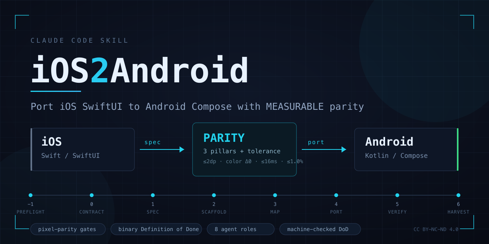
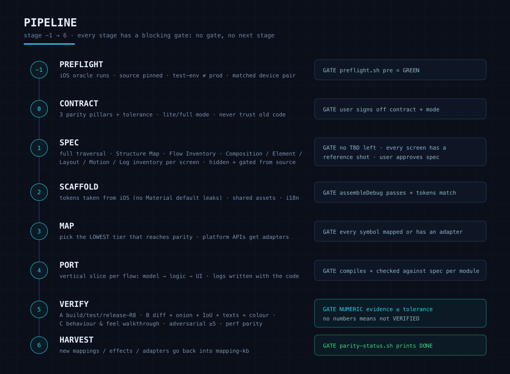
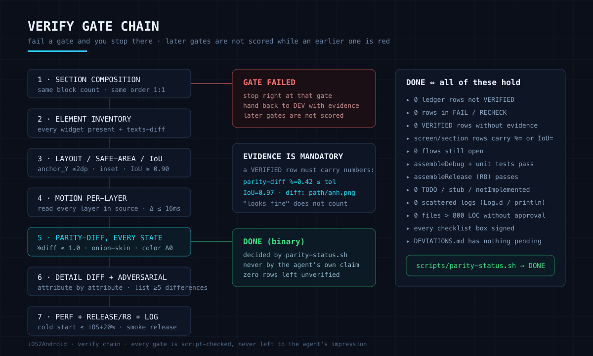

<div align="center">



[Tiếng Việt](README.md) · [English](README.en.md) · [中文](README.zh-CN.md) · **한국어** · [日本語](README.ja.md)


</div>

## iOS2Android란

**Claude Code용 skill**입니다. iOS 앱(Swift/SwiftUI)을 Android(Kotlin/Compose)로 port하는 절차이며, 목표는 **측정 가능한 parity**이지 "대충 비슷하게 다시 만들기"가 아닙니다.

AI에게 앱 port를 맡길 때의 문제는 이렇습니다. *비슷해 보이는* Android 버전을 만들어 놓고, 섹션 몇 개가 빠지고, 세로 리듬이 어긋나고, 효과가 사라진 채로 "기본적으로 다 됐다"고 선언합니다. 이 skill은 "완료"를 agent가 스스로 판단하는 것이 아니라 **script가 결정하는 이진 조건**으로 바꿉니다.

```
측정값 없음    →  VERIFIED 아님
VERIFIED 아님  →  DONE 아님
DONE 아님      →  agent는 멈출 수 없음
```

## parity 3대 기둥과 허용 오차

| 항목 | 최대 오차 |
|---|---|
| 위치 / 크기 / spacing | ≤ 2 dp |
| 색상 | 0 (hex/alpha 정확히 일치) |
| animation 지속 시간 | ≤ 16 ms (60fps 기준 1 frame) |
| state별 pixel visual diff | 시스템 chrome 제외 후 ≤ 1.0% |
| 텍스트 내용 | 0 (i18n key를 통해 완전히 동일) |

- **기둥 1 Visual**: layout, 색상, typography, icon, theme, 모든 state.
- **기둥 2 Behavioral**: 기능, state machine, validation, edge case, persistence, navigation.
- **기둥 3 Perceptual**: animation, transition, gesture, haptic, scroll physics.

100% 동일하게 만들 수 없는 부분(시스템 font, back gesture, ripple, Apple 전용 서비스)은 `DEVIATIONS.md`에 기록하고 사용자 승인을 기다려야 합니다. 말없이 다르게 구현해서는 안 됩니다.

## Pipeline



## 검증 게이트 체인

스크린샷과 측정값이 없으면 parity도 없습니다. 모든 게이트는 script가 검사하며, 통과하지 못한 게이트에서 즉시 멈춥니다.



## repo 구성

| 파일 | 역할 |
|---|---|
| `SKILL.md` | 나침반: formula card, pipeline, 18개 불변 규칙, load-on-demand 표 |
| `enforcement.md` | 중도 포기 방지 강제 장치: ledger, Definition of Done, no-stop, anti-stub, element gate, section gate, release gate, log gate |
| `measurement.md` | 실측 방법: visual diff, onion-skin, IoU, 기기 페어, animation 측정, perf, regression baseline |
| `mapping-kb.md` | Swift ↔ Kotlin 매핑 저장소: motion, layout, state, concurrency, navigation, API, typography, i18n, log |
| `orchestration.md` | 한도를 둔 작업 분할, 여러 세션에 걸친 resume, context 비대화 방지 |
| `roles.md` | 8개 역할: MANAGER, UI-AUDITOR, SOURCE-ANALYST, FLOW-CHECKER, DEV-FE, DEV-FUNC, QA-RECONCILER, PERF-OPTIMIZER |
| `telegram-grade.md` | Telegram source에서 뽑아낸 animation/render 기법과 과용을 막는 게이트 |
| `parity-spec.template.md` | 골든 문서 템플릿: Structure Map, Flow Inventory, ledger, 화면별 spec |
| `manifest.template.md` | 입력 선언: path, source pin, test-env, 기기 페어, mode |
| `checklists/` | 직접 서명하는 checklist 3종: ui-parity, capability, standards |
| `scripts/` | script 7개: preflight, inventory, extract-assets, parity-diff, verify, parity-status, selftest |
| `benchmark/` | 미니 iOS 앱 + process compliance 채점기 |

## 설치

**방법 1: plugin marketplace 사용 (가장 빠르고 업데이트도 명령 하나로 끝납니다)**

```
/plugin marketplace add VietUy001/iOS2Android
/plugin install ios2android@ios2android
```

**방법 2: 직접 복사**

```bash
git clone https://github.com/VietUy001/iOS2Android.git
mkdir -p ~/.claude/skills
cp -R iOS2Android/plugins/ios2android/skills/ios2android ~/.claude/skills/
chmod +x ~/.claude/skills/ios2android/scripts/*.sh
```

그다음 Claude Code에서 입력합니다:

```
/ios2android
```

skill이 절대 경로 두 개(iOS 소스와 대상 Android 폴더)를 묻고, 문서를 둘 위치를 확인한 뒤 preflight를 실행합니다.

## 환경 요구 사항

- macOS, Xcode + iOS Simulator (oracle 역할입니다. iOS 앱을 실행할 수 없으면 비교할 대상 자체가 없습니다).
- Android SDK, JDK, emulator 또는 실기기.
- `adb`, `ffmpeg`, ImageMagick (`compare`, `convert`, `composite`, `identify`), `git`.
- 중요: Android emulator는 기준이 되는 iOS 기기와 **logical size가 같아야** 합니다(예: 양쪽 모두 393x852). dp가 어긋나면 %diff와 IoU 수치가 모두 무의미해집니다.

## 셀프 체크

```bash
scripts/selftest.sh      # 게이트 39개 assertion: ledger, 증거, deviation, preflight, IoU, texts-diff
benchmark/selftest.sh    # benchmark 채점기 검사
```

샘플 앱으로 benchmark 실행:

```bash
T=$(mktemp -d); cp -R benchmark/fixture-ios "$T/ios"; mkdir "$T/android"
# $T/ios와 $T/android를 대상으로 /ios2android 실행, stage 1까지 진행
benchmark/score.sh "$T/parity-spec.md" "$T/android"
```

## 알려진 제약

- oracle이 반드시 iOS Simulator여야 하므로 macOS에서만 동작합니다.
- benchmark는 **절차**를 채점하며 pixel parity는 채점하지 않습니다. pixel 측정에는 simulator와 emulator가 모두 필요해 자동화할 수 없습니다.
- iOS 앱을 build할 수 없으면 ORACLE-LIMITED를 켜고 기둥 1을 포기해야 하며, 사용자의 서명 동의가 필요합니다.
- doctrine 문서는 베트남어로 작성되어 있습니다. 영어 요약본은 [docs/overview.en.md](docs/overview.en.md)에 있습니다.

## 작성자

**Nguyen Viet Uy** · [@VietUy001](https://github.com/VietUy001)

- Facebook: https://www.facebook.com/1206463405
- Telegram: https://t.me/QTUNUy

피드백, 버그 제보, 사용 관련 질문은 Telegram으로 연락하거나 저장소에 이슈를 등록하면 됩니다.

## 라이선스

[CC BY-NC-ND 4.0](LICENSE): 개인, 학습, 연구, 비상업적 사내 업무 용도로는 무료로 사용할 수 있습니다. **상업적 이용 금지. 수정본 배포 금지.** 사용할 때는 출처를 밝히고 원본 repo 링크를 남겨 주세요.

작성자는 이 repo를 다른 곳에 **mirror하거나 재게시하지 않기를** 바랍니다. 원본 링크를 안내해 주시면 모두가 항상 최신 버전을 받을 수 있습니다.

<div align="center">
<sub>iOS2Android · parity는 느낌이 아니라 측정값입니다</sub>
</div>
